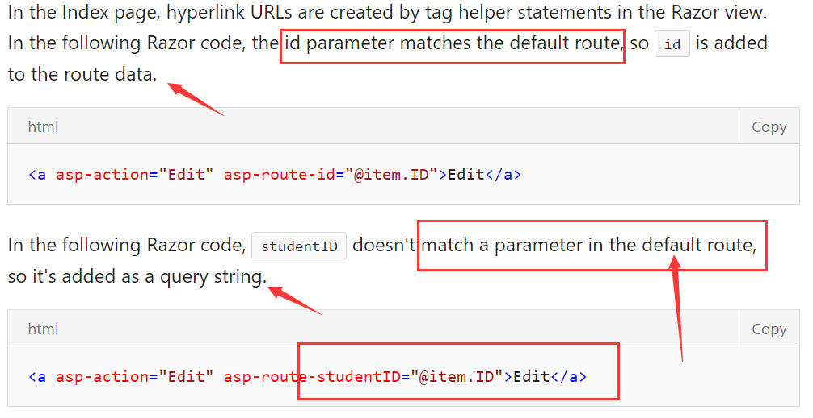
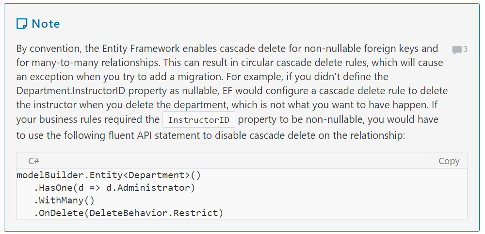
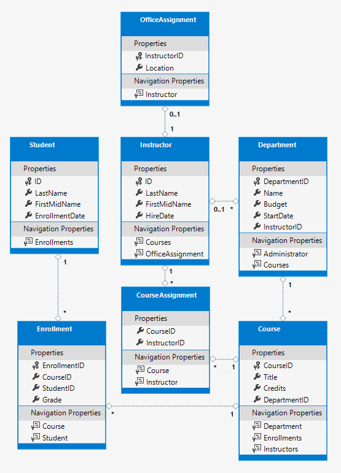

[https://docs.microsoft.com/en-us/aspnet/core/data/ef-mvc/intro](https://docs.microsoft.com/en-us/aspnet/core/data/ef-mvc/intro)

## asp.net mvc + ef core

### 2017-3-7

By default, the Entity Framework interprets（解析） a property that's named `ID` or `classnameID` as the primary key.

using ID without classname makes it easier to implement inheritance in the data model.

-----------

（navigation属性，即数据库中的一对一，一对多属性）

The StudentID property is `a foreign key`, and the corresponding navigation property is Student. 
An Enrollment entity is associated with one Student entity, 
so the property can only hold a single Student entity 
(unlike the Student.Enrollments navigation property you saw earlier, which can hold multiple Enrollment entities).

--------------


（ef中外键字段的判定）

Entity Framework interprets a property as a 
foreign key property if it's named `<navigation property name><primary key property name>` 
(for example, `StudentID` for the `Student` navigation property since the `Student` entity's primary key is `ID`). 
Foreign key properties can also be named simply `<primary key property name>` (for example, `CourseID` since the `Course` entity's primary key is `CourseID`).

---------------

If you specify ICollection<T>, EF creates a `HashSet<T>` collection by default.

（DatabaseGenerated 特性标识）

Basically, this attribute lets you enter the primary key for the course rather than having the database generate it.

（使用ef的主要目标就是根据model生成dbContext）

The main class that coordinates Entity Framework functionality 
for a given data model is the database context class. 
You create this class by deriving from the System.Data.Entity.DbContext class

--------------

* （dbContext中包含 dbSet<T>）This code creates a DbSet property for each entity set. 
In Entity Framework terminology, an entity set typically corresponds to a database table, and an entity corresponds to a row in the table.


* （一个dbSet对应一个数据库table，取dbSet的名字）
* 
* When the database is created, EF creates tables that have names the same as the DbSet property names. Property names for collections are typically plural (Students rather than Student), but developers disagree about whether table names should be pluralized or not. For these tutorials you'll override the default behavior by specifying singular table names in the DbContext. 


* （services 通过DI在程序启动时进行注册，需要使用这些services 的模块通过其构造函数的参数进行调用）
* 
* ASP.NET Core implements dependency injection by default. Services (such as the EF database context) are registered with dependency injection during application startup. Components that require these services (such as MVC controllers) are provided these services via constructor parameters.

* （LocalDB）LocalDB starts on demand and runs in user mode, so there is no complex configuration. By default, LocalDB creates .mdf database files in the C:/Users/<user> directory.

* （通过构造函数参数，使用依赖注入初始化dbContext）
* 
* First, add the context to the method signature so that ASP.NET dependency injection can provide it to your DbInitializer class.

* （ef搭建脚手架action和view）
* 
* The automatic creation of CRUD action methods and views is known as scaffolding. Scaffolding differs from code generation in that the scaffolded code is a starting point that you can modify to suit your own requirements, whereas you typically don't modify generated code. When you need to customize generated code, you use partial classes or you regenerate the code when things change.

* （注意： DbInitializer 使用的是 Models名称空间）
* （如果没有创建dbContext，使用脚手架时可以自动创建）
* 
* (The scaffolding engine can also create the database context for you if you don't create it manually first as you did earlier for this tutorial. You can specify a new context class in the Add Controller box by clicking the plus sign to the right of Data context class. Visual Studio will then create your DbContext class as well as the controller and views.)

------------

`EnsureCreated`（未创建数据库的话，保证创建）

When you started the application, the DbInitializer.Initialize method calls EnsureCreated. EF saw that there was no database and so it created one

-----------
## Conventions(约定或假设)

property, navigation property, 主键定义，外键定义

The amount of code you had to write in order for the Entity Framework to be able to create a complete database for you is minimal because of the use of conventions, or assumptions that the Entity Framework makes.

* The names of `DbSet` properties are used as table names. For entities not referenced by a `DbSet` property, entity class names are used as table names.

* Entity property names are used for column names.

* Entity properties that are named ID or classnameID are recognized as primary key properties.

* A property is interpreted as a foreign key property if it's named *<navigation property name><primary key property name>* (for example, `StudentID` for the `Student` navigation property since the `Student` entity's primary key is `ID`). Foreign key properties can also be named simply *<primary key property name>* (for example, `EnrollmentID` since the `Enrollment` entity's primary key is `EnrollmentID`).

Conventional behavior can be overridden. For example, you can explicitly specify table names, as you saw earlier in this tutorial. And you can set column names and set any property as primary key or foreign key, as you'll see in a [later tutorial](complex-data-model.md) in this series.


-------------
## Async

**（编译器把一个方法分成多个部分，当一部分完成后，通过callback 调用下一个部分）**

* The `async` keyword tells the compiler to generate callbacks for parts of the method body and to automatically create the `Task<IActionResult>` object that is returned.

* The return type `Task<IActionResult>` represents ongoing work with a result of type `IActionResult`.

* The `await` keyword causes **the compiler to split the method into two parts**. The first part ends with the operation that is started asynchronously. The second part is put into a callback method that is called when the operation completes.

* `ToListAsync` is the asynchronous version of the `ToList` extension method.


---------------
## `<span>`标签
The HTML `<span>` element is a generic inline container for phrasing content, which does not inherently represent anything. 
It can be used to group elements for styling purposes (using the class or id attributes), or because they share attribute values, such as lang. 
It should be used only when no other semantic element is appropriate. 
`<span>` is very much like a `<div>` element, but `<div>` is a block-level element whereas a `<span>` is an inline element.

`<span>`无实际含义， 同div功能一样。但是div是块元素，span是行元素

## Route data and Query string



## model binder

a `model binder` converts posted form values to CLR types and passes them to the action method in parameters

## validateAntiForgeryToken

The `ValidateAntiForgeryToken` attribute helps prevent cross-site request forgery (CSRF) attacks. 
The token is `automatically injected` into the view by the [FormTagHelper](https://github.com/aspnet/Mvc/blob/dev/src/Microsoft.AspNetCore.Mvc.TagHelpers/FormTagHelper.cs) 
and is included when the form is submitted by the user. 
The token is validated by the `ValidateAntiForgeryToken` attribute. 

## overPosting

```csharp
public class Student
{
    public int ID { get; set; }
    public string LastName { get; set; }
    public string FirstMidName { get; set; }
    public DateTime EnrollmentDate { get; set; }
    public string Secret { get; set; }
}
```

Even if you don't have a `Secret` field on the web page, 
a hacker could use a tool such as Fiddler, or write some JavaScript, to post a `Secret` form value. 
Without the `Bind` attribute limiting the fields that `the model binder` uses when it creates a Student instance, 
the model binder would pick up that `Secret` form value and use it to create the Student entity instance. 
Then whatever value the hacker specified for the `Secret` form field would be updated in your database. 

It's a security best practice to use the `Include` parameter with the Bind attribute to whitelist fields.
It's also possible to use the `Exclude` parameter to blacklist fields you want to exclude. 
The reason `Include` is more secure is that when you add a new property to the entity, 
the new field is not automatically protected by an `Exclude` list.

`Bind[''']`的方式会清除其中未包含的字段，不适合只修改部分字段值的场景。

The scaffolder generated a `Bind` attribute and added the entity created by the model binder to the entity set with a `Modified` flag. 
That code is not recommended for many scenarios because the `Bind` attribute 
clears out `any pre-existing data` in fields not listed in the `Include` parameter.

-------------
## Entity States

The database context `keeps track of whether entities in memory` are in sync with their corresponding rows in the database, 
and this information determines what happens when you call the `SaveChanges` method.

1. Added
2. Unchanged
3. Modified
4. Deleted
5. Detached(分离的) -- The entity isn't being tracked by the database context.

## dbContext( desktop vs web application)

In a desktop application, state changes are typically set automatically. 
You read an entity and make changes to some of its property values. 
This causes its entity state to automatically be changed to `Modified`. 
Then when you call `SaveChanges`, the Entity Framework generates a SQL UPDATE statement that updates only the actual properties that you changed.

In a web app, the `DbContext` that initially reads an entity 
and displays its data to be edited is disposed after a page is rendered. 
When the HttpPost `Edit` action method is called,  `a new web request` is made and you have `a new instance` of the `DbContext`. 
If you re-read the entity in that new context, you simulate desktop processing.

每一次新的请求都会生成新的 controller，也即新 dbContext。

## Delete

You'll add a try-catch block to the HttpPost Delete method to handle 
any errors that might occur when the database is updated. 
If an error occurs, the HttpPost Delete method calls the HttpGet Delete method, 
passing it a parameter that indicates that an error has occurred. 
The HttpGet Delete method then redisplays the confirmation page along with the error message,
 giving the user an opportunity to cancel or try again.

## Closing database connection

In *Startup.cs* you call the `AddDbContext extension method` to provision(供给) the `DbContext` class in the ASP.NET DI container. 
That method sets the service lifetime to `Scoped` by default. 
`Scoped` means the context object lifetime **coincides（相一致）** with the web request life time, 
and the `Dispose` method will be called automatically at the end of the web request.

## transaction - 事务

By default the Entity Framework implicitly implements transactions. 
In scenarios where you make changes to multiple rows or tables and then call `SaveChanges`, 
the Entity Framework automatically makes sure that either 
all of your changes succeed or they all fail. 
If some changes are done first and then an error happens, those changes are automatically rolled back. 

## No-tracking queries

When a database context retrieves table rows and creates entity objects that represent them, 
**by default it keeps track of whether the entities in memory are in sync with what's in the database**. 
The data in memory acts as a `cache` and is used when you update an entity. 
This caching is `often unnecessary` in a web application because context instances 
are typically short-lived (a new one is created and disposed for each request) 
and **the context that reads an entity is typically disposed before that entity is used again**.

## IQueryable

The code creates an `IQueryable` variable before the switch statement, modifies it in the switch statement, 
and calls the `ToListAsync` method after the `switch` statement. 
**When you create and modify `IQueryable` variables, no query is sent to the database.**
The query is not executed until you convert the `IQueryable` object into a collection by calling a method such as `ToListAsync`. 

 For example, the .NET Framework implementation of the `Contains` method performs a case-sensitive comparison by default, 
 but in SQL Server this is determined by the collation setting of the SQL Server instance. 
 That setting defaults to case-insensitive. 
 You could call the `ToUpper` method to make the test explicitly case-insensitive:  
 *Where(s => s.LastName.ToUpper().Contains(searchString.ToUpper())*. 
 
That would ensure that results stay the same if you change the code later to 
use a repository which returns   an `IEnumerable` collection instead of an `IQueryable` object. 
**(When you call the `Contains` method on an `IEnumerable` collection, you get the .NET Framework implementation;
 when you call it on an `IQueryable` object, you get the database provider implementation.)** 
However, there is a performance penalty for this solution. 

The `ToUpper` code would put a function in the WHERE clause of the TSQL SELECT statement. 
**That would prevent the optimizer from using an index（数据库索引）.** 
Given that SQL is **mostly installed as case-insensitive**, 
it's best to avoid the `ToUpper` code until you migrate to a case-sensitive data store.

## Form

By default, the `<form>` tag helper submits form data with a POST, 
which means that parameters are passed in the HTTP message body and not in the URL as query strings. 
When you specify HTTP GET, the form data is passed in the URL as query strings, 
which enables users to bookmark the URL. 
The W3C guidelines recommend that you should use GET when the action does not result in an update.

`<form>`默认是post，`<a>`只能是get。相对于 **tagHelper**的`asp-route-data`

## async

A `CreateAsync` method is used instead of a constructor to 
create the `PaginatedList<T>` object because **constructors can't run asynchronous code.**

## EF1.0

In the 1.0 version of Entity Framework Core, the entire result set is returned to the client, 
and grouping is done on the client. In some scenarios this could create performance problems. 
Be sure to test performance with production volumes of data, 
and if necessary use raw SQL to do the grouping on the server. 

--------------------
## DataType

The `DataType` attribute can also enable the application to automatically provide type-specific features. 
For example, a `mailto:` link can be created for `DataType.EmailAddress`, 
and a date selector can be provided for `DataType.Date` in browsers that `support HTML5.` 
The `DataType` attribute emits HTML 5 `data-` (pronounced data dash) attributes that HTML 5 browsers can understand. 
The `DataType` attributes do not provide any validation.

## 

The `MaxLength` attribute provides functionality similar to the `StringLength` attribute 
but doesn't provide client side validation.

Types that `can't be null` are automatically treated as required fields.

FullName is a `calculated property` that returns a value that's created by concatenating two other properties. 
Therefore it has only `a get accessor`, and no FullName column will be generated in the database.

If a navigation property can hold multiple entities, 
its type must be a list in which entries can be added, deleted, and updated.  
You can specify `ICollection<T>` or a type such as `List<T>` or `HashSet<T>`. 
If you specify `ICollection<T>`, EF creates a `HashSet<T>` collection by default.

But the Entity Framework can't automatically recognize InstructorID as the primary key of this entity 
because its name doesn't follow **the ID or classnameID naming convention.**
Therefore, the `Key attribute` is used to identify it as the key.

## 

Column mapping is generally not required, because the Entity Framework chooses the 
appropriate SQL Server data type based on the CLR type that you define for the property. 
The CLR decimal type maps to a SQL Server decimal type. 
But in this case you know that the column will be holding currency amounts, 
and the money data type is more appropriate for that.




## With payload

There's a many-to-many relationship between the Student and Course entities, 
and the Enrollment entity functions as a many-to-many join table with payload in the database. 
**"With payload"** means that the Enrollment table **contains additional data** besides foreign keys 
for the joined tables (in this case, a primary key and a Grade property).

If the Enrollment table didn't include grade information, 
it would only need to contain the two foreign keys CourseID and StudentID. 
In that case, it would be a many-to-many join table **without payload (or a pure join table)** in the database. 

## Composite Key

**联合主键**
The only way to identify composite primary keys to EF is by using the fluent API 
(it can't be done by using attributes).

## Fluent API and Attributes

Some attributes such as MinimumLength can't be applied with the fluent API. As mentioned previously, 
MinimumLength doesn't change the schema, it only applies a client and server side validation rule.

If you do use both, note that wherever there is a conflict, **Fluent API overrides attributes.**



----------------------
## Tag Helper and Html Helper

"In many cases, HTML Helpers provide an alternative approach to a specific Tag Helper, 
but it's important to recognize that **Tag Helpers do not replace HTML Helpers**
and there is not a Tag Helper for each HTML Helper."

## ef model update

``` console
dotnet ef migrations add MaxLengthOnNames -c SchoolContext
dotnet ef database update -c SchoolContext
```


---------------------------
[Images/entity diagram.png]:https://github.com/ichengzi/learn-asp.net-core/raw/master/src/ContosoUniversity/Images/entity%20diagram.png